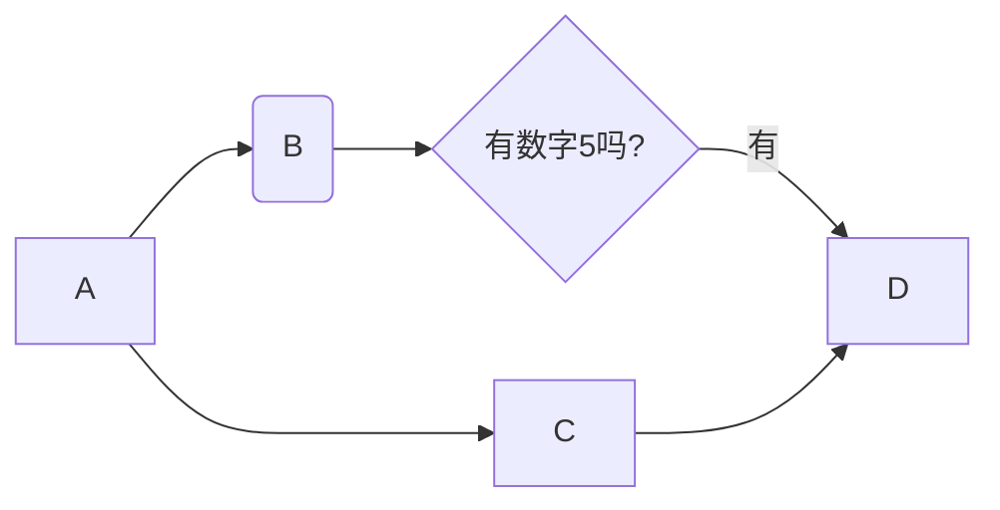
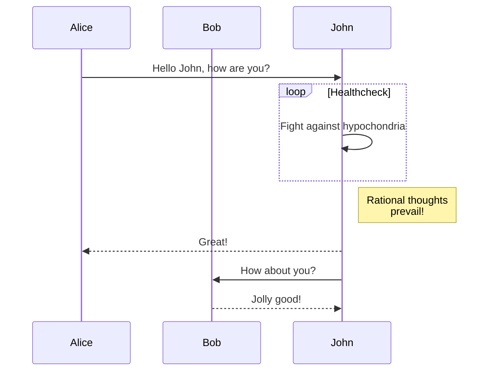
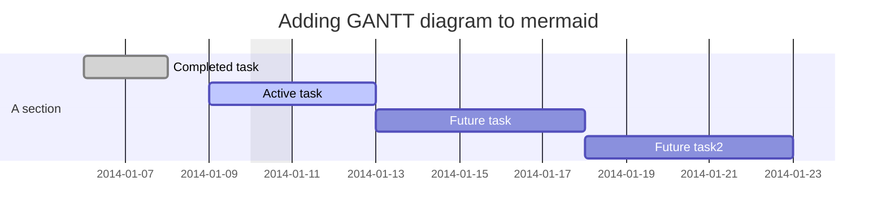
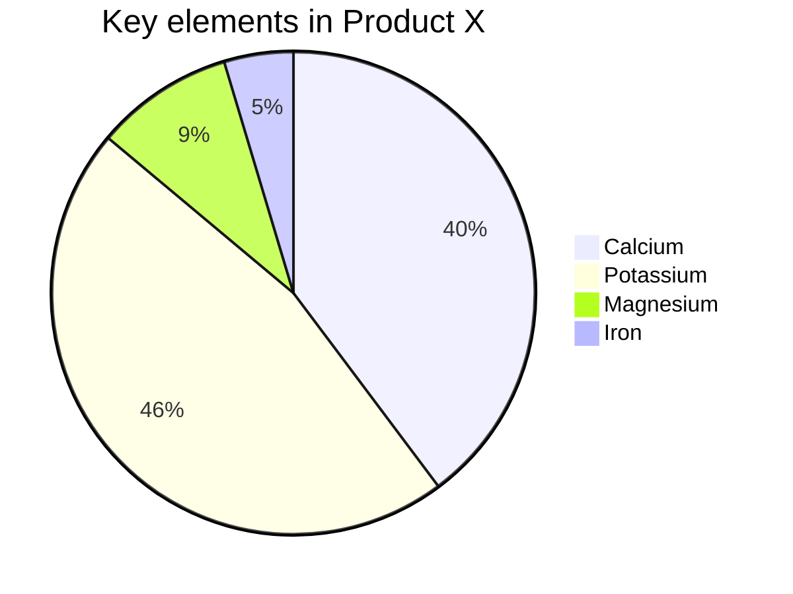

---

title: markdown语法详情
date: 2019-12-27 15:44:24
tags:
---

我展示的是一级标题
=================
我展示的是二级标题
-----------------

# 一级标题
## 二级标题
### 三级标题
#### 四级标题
##### 五级标题
###### 六级标题

<!-- more -->

我是段落1 
我是段落1

*斜体文本*  
_斜体文本_  
**粗体文本**   
__粗体文本__  
***粗斜体文本***  
___粗斜体文本___  
~~baidu.com~~  
<u>带下划线</u>  

创建脚注格式类似这样 [^RUNOOB]。

[^RUNOOB]: 菜鸟教程 -- 学的不仅是技术，更是梦想！！！

* 第一项
* 第二项
* 第三项

+ 第一项
+ 第二项
+ 第三项

- 第一项
- 第二项
- 第三项

1. 第一项
    - 第一项
    - 第二项
    - 第三项

2. 第二项
    * abc
    * efg
    * 333

3. 第三项
    - haha
    - 99523
    - abcccc

> 区块的引用
> 1. 引言
> 2. 概述
> 3. summary

> mysql 基本信息

> mysql 索引

## Markdown 代码
`printf() //函数 ` 

    <?php
    echo 'runoob';

    function test(){
        return 'test';
    }

````javascript
$(document).ready(function(){

})
````

````php
<?php
    echo 'runoob';

    function test(){
        return 'test';
    }
````

````shell
date>>1.txt
````

[redis指南](http://www.baidu.com)  
<http://www.baidu.com>

链接也可以用变量来代替，文档末尾附带变量地址：  
这个链接用 1 作为网址变量 [Google][1]  
这个链接用 runoob 作为网址变量 [Runoob][runoob]  
然后在文档的结尾为变量赋值（网址）


## 图片
![alt webpack 4][img]

## Markdown 表格
Markdown 制作表格使用 | 来分隔不同的单元格，使用 - 来分隔表头和其他行。  
语法格式如下：  

|  表头   | 表头  |
|  ----  | ----  |
| 单元格  | 单元格 |
| 单元格  | 单元格 |

  
### 我们可以设置表格的对齐方式：  
  
  
| 左对齐 | 右对齐 | 居中对齐 |
| :-----| ----: | :----: |
| 单元格 | 单元格 | 单元格 |
| 单元格 | 单元格 | 单元格 |

## Markdown 高级技巧
### 支持的 HTML 元素  
不在 Markdown 涵盖范围之内的标签，都可以直接在文档里面用 HTML 撰写。  

目前支持的 HTML 元素有：\<kbd> \<b> \<i> \<em> \<sup> \<sub> \<br>等 ，如：  
````
使用 <kbd>Ctrl</kbd>+<kbd>Alt</kbd>+<kbd>Del</kbd> 重启电脑
````
<kbd>Ctrl</kbd>+<kbd>Alt</kbd>+<kbd>Del</kbd>
### 转义
Markdown 使用了很多特殊符号来表示特定的意义，如果需要显示特定的符号则需要使用转义字符，Markdown 使用反斜杠转义特殊字符：
````
**文本加粗** 
\*\* 正常显示星号 \*\*
````
**文本加粗**  
\*\* 正常显示星号 \*\*

### 公式
当你需要在编辑器中插入数学公式时，可以使用两个美元符 $$ 包裹 TeX 或 LaTeX 格式的数学公式来实现。提交后，问答和文章页会根据需要加载 Mathjax 对数学公式进行渲染。如：
````
$$
\mathbf{V}_1 \times \mathbf{V}_2 =  \begin{vmatrix} 
\mathbf{i} & \mathbf{j} & \mathbf{k} \\
\frac{\partial X}{\partial u} &  \frac{\partial Y}{\partial u} & 0 \\
\frac{\partial X}{\partial v} &  \frac{\partial Y}{\partial v} & 0 \\
\end{vmatrix}
$$tep1}{\style{visibility:hidden}{(x+1)(x+1)}}
$$
````
$$
\mathbf{V}_1 \times \mathbf{V}_2 =  \begin{vmatrix} 
\mathbf{i} & \mathbf{j} & \mathbf{k} \\
\frac{\partial X}{\partial u} &  \frac{\partial Y}{\partial u} & 0 \\
\frac{\partial X}{\partial v} &  \frac{\partial Y}{\partial v} & 0 \\
\end{vmatrix}
$$tep1}{\style{visibility:hidden}{(x+1)(x+1)}}
$$

### 流程图








[1]: http://www.google.com/
[runoob]: http://www.runoob.com/
[img]:https://ss0.bdstatic.com/70cFuHSh_Q1YnxGkpoWK1HF6hhy/it/u=2236729454,1077574892&fm=26&gp=0.jpg
